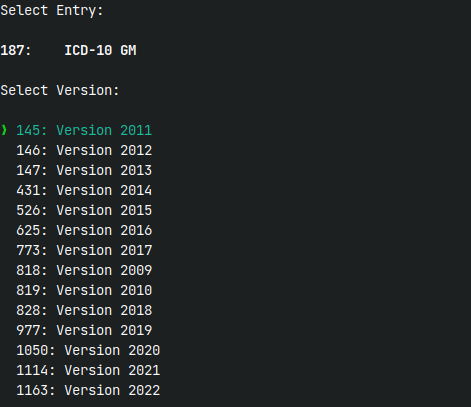

# Onkostar Developer Tools

Tools zur Verwendung in der Onkostar-Plugin-Entwicklung

Grundsätzlich ist immer die Angabe der Datenbankverbindung erforderlich.

```
Usage: onkostar-dev-tools [OPTIONS] --user <USERNAME> --password <PASSWORD> <COMMAND>

Commands:
  merkmalskatalog  Befehle für Merkmalskataloge
  patient          Befehle für Patienten
  user             Befehle für Benutzer
  help             Print this message or the help of the given subcommand(s)

Options:
  -U, --user <USERNAME>      Benutzername für Datenbankzugriff
      --password <PASSWORD>  Passwort für Datenbankzugriff
  -H, --host <HOST>          Datenbankhost [default: localhost]
  -P, --port <PORT>          Datenbankport [default: 3306]
  -D, --database <DBNAME>    Name der Datenbank [default: onkostar]
  -h, --help                 Print help
  -V, --version              Print version
```

## Benutzer

Befehle zur Benutzerverwaltung

* Ändern des Benutzerpasswords: `onkostar-dev-tools user password [--login <LOGIN>] <PASSWORD>`

## Patienten

Befehle zum Anpassen von Patienten

* Anonymisieren von Patientendaten in Tabelle `patient`: `onkostar-dev-tools patient anonym`

## Datenkataloge

Befehle zur Recherche in Datenkatalogen.

### Anzeige von Datenkatalogen

Der Befehl `onkostar-dev-tools datenkatalog ls -q <QUERY>` zeigt eine Liste von Datenkatalogen an, die die angegebene Zeichenkette beinhalten. Nach Auswahl eines Datenkatalogs werden ID, Name und Beschreibung des Datenkatalogs angezeigt.

### Entfernen von Einträgen in Datenkatalogen

Der Befehl `onkostar-dev-tools datenkatalog clean <ID>` entfernt alle Einträge aus einer Datenkatalogtabelle und zugehörige Einträge in der Tabelle `prozedur`.

## Merkmalskataloge

Befehle zur Recherche in Merkmalskatalogen.



### Anzeige von Merkmalskatalogen

Der Befehl `onkostar-dev-tools merkmalskatalog ls -q <QUERY>` zeigt eine Liste von Merkmalskatalogen an, die die angegebene Zeichenkette beinhalten. Nach Auswahl eines Merkmalkatalogs kann eine vorhandene Version interaktiv ausgewählt werden und letztendlich vorhandene Inhalte angezeigt werden.

### Anzeige einer Version eines Merkmalskatalogs

Der Befehl `onkostar-dev-tools merkmalskatalog versions <ID>` zeigt eine Liste von Versionen des gewählten Merkmalskatalogs an. Nach Auswahl einer Version werden die Inhalte angezeigt.