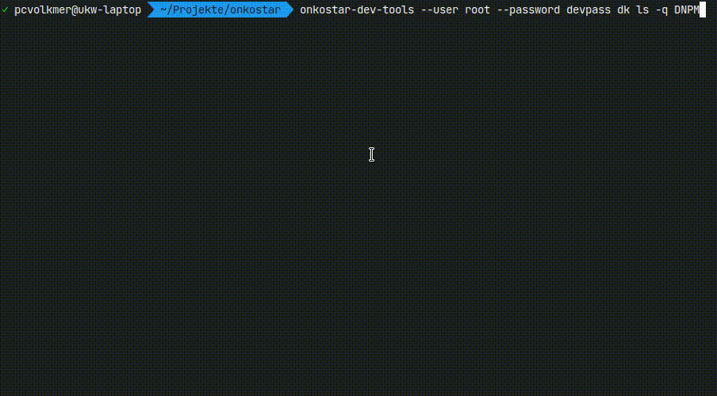

# Onkostar Developer Tools

Tools zur Abfrage und Anpassung von Datenbankeinträgen in der Onkostar-Plugin-Entwicklung.



Grundsätzlich ist immer die Angabe der Datenbankverbindung erforderlich. Dabei werden folgende Standardwerte verwendet:

* *`host`*: `localhost`
* *`port`*: `3306`
* *`database`*: `onkostar`

Sind Benutzername und/oder Passwort nicht als Programmargument angegeben, werden Sie abgefragt.

```
Usage: onkostar-dev-tools [OPTIONS] <COMMAND>

Commands:
  datenkatalog     Befehle für Datenkataloge
  dk               Befehle für Datenkataloge (kurz)
  form             Befehle für Formulare
  merkmalskatalog  Befehle für Merkmalskataloge
  mk               Befehle für Merkmalskataloge (kurz)
  patient          Befehle für Patienten
  user             Befehle für Benutzer
  help             Print this message or the help of the given subcommand(s)

Options:
  -U, --user <USERNAME>      Benutzername für Datenbankzugriff
      --password <PASSWORD>  Passwort für Datenbankzugriff
  -H, --host <HOST>          Datenbankhost [default: localhost]
  -P, --port <PORT>          Datenbankport [default: 3306]
  -D, --database <DBNAME>    Name der Datenbank [default: onkostar]
  -h, --help                 Print help
  -V, --version              Print version
```

## Benutzer

Befehle zur Benutzerverwaltung

* Ändern des Benutzerpasswords: `onkostar-dev-tools user password [--login <LOGIN>] <PASSWORD>`

## Patienten

Befehle zum Anpassen von Patienten

* Anonymisieren von Patientendaten in Tabelle `patient`: `onkostar-dev-tools patient anonym`

## Datenkataloge

Befehle für Datenkataloge.

### Anzeige von Datenkatalogen

Der Befehl `onkostar-dev-tools datenkatalog ls -q <QUERY>` zeigt eine Liste von Datenkatalogen an, die die angegebene Zeichenkette beinhalten. Nach Auswahl eines Datenkatalogs werden ID, Name und Beschreibung des Datenkatalogs angezeigt. Danach sind interaktiv weitere Aktionen möglich.

### Anzeige von Formularen die einen Datenkatalog verwenden

Der Befehl `onkostar-dev-tools datenkatalog forms <ID>` zeigt eine Liste von Formularen an, die den angegebenen Datenkatalog verwenden.

### Entfernen von Einträgen in Datenkatalogen

Der Befehl `onkostar-dev-tools datenkatalog clean <ID>` entfernt alle Einträge aus einer Datenkatalogtabelle und zugehörige Einträge in der Tabelle `prozedur`, sowie für Unterformulare. Die Anzahl der gelöschten Einträge wird angezeigt.

## Formulare

Befehle für Formulare

### Anzeige von Formularen

Der Befehl `onkostar-dev-tools form ls -q <QUERY>` zeigt eine Liste von Formularen an, die die angegebene Zeichenkette beinhalten. Nach Auswahl eines Formulars werden ID, Name und Beschreibung des Formulars angezeigt. Danach sind interaktiv weitere Aktionen möglich.

### Anzeige von Unterformularen

Der Befehl `onkostar-dev-tools form uf <ID>` zeigt eine Liste der verwendeten Unterformulare an.

### Anzeige von Datenkatalogen, die in einem Formular verwendet werden

Der Befehl `onkostar-dev-tools form dk <ID>` zeigt eine Liste von Datenkatalogen an, die im angegebenen Formular verwendet werden.

### Entfernen von Einträgen in Datenkatalogen dieses Formulars

Der Befehl `onkostar-dev-tools form clean <ID>` entfernt alle Einträge aus zum Formular gehörenden Datenkatalogtabellen und zugehörige Einträge in der Tabelle `prozedur`, sowie für Unterformulare. Die Anzahl der gelöschten Einträge wird angezeigt.

## Merkmalskataloge

Befehle zur Recherche in Merkmalskatalogen.

### Anzeige von Merkmalskatalogen

Der Befehl `onkostar-dev-tools merkmalskatalog ls -q <QUERY>` zeigt eine Liste von Merkmalskatalogen an, die die angegebene Zeichenkette beinhalten. Nach Auswahl eines Merkmalkatalogs kann eine vorhandene Version interaktiv ausgewählt werden und letztendlich vorhandene Inhalte angezeigt werden.

### Anzeige einer Version eines Merkmalskatalogs

Der Befehl `onkostar-dev-tools merkmalskatalog versions <ID>` zeigt eine Liste von Versionen des gewählten Merkmalskatalogs an. Nach Auswahl einer Version werden die Inhalte angezeigt.